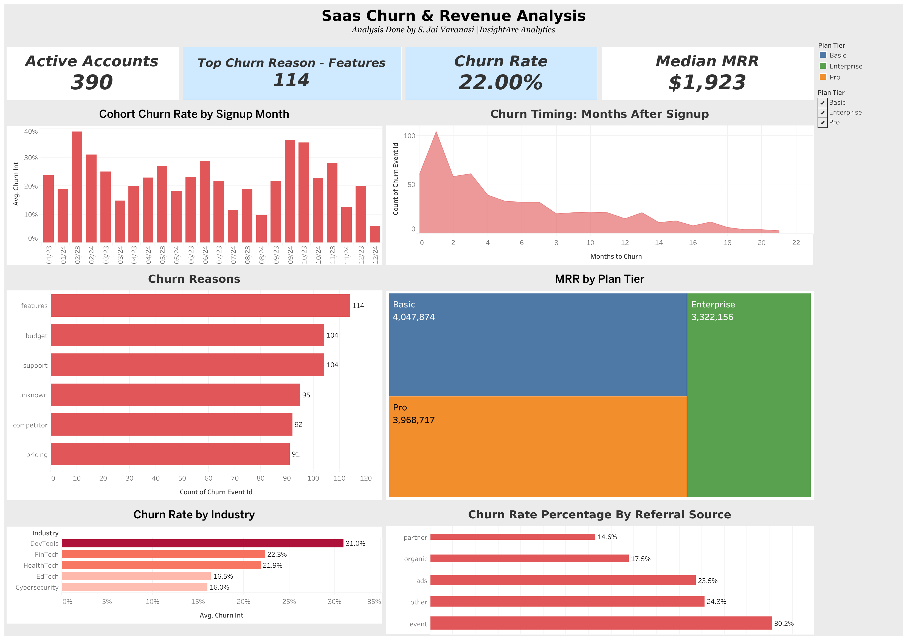

# RavenStack SaaS Churn & Revenue Analysis



## Business Problem

RavenStack is a stealth-mode SaaS startup delivering AI-driven team tools, piloted with coding bootcamp graduates across 5 industries. Before public launch, leadership needs answers to three critical questions:

1. **Where are customers dropping off** and how early does churn happen?
2. **Why are they leaving** and which segments are most at risk?
3. **What should we do about it** to maximize retention before scaling?

## Dataset

5 relational tables with proper foreign keys (33,100+ rows total):

| Table | Rows | Description |
|-------|------|-------------|
| accounts | 500 | Master customer table: industry, country, plan tier, churn flag |
| subscriptions | 5,000 | Billing history: MRR, ARR, upgrades, downgrades, tenure |
| feature_usage | 25,000 | Product engagement: 40 features, usage counts, duration, errors |
| support_tickets | 2,000 | Support interactions: resolution time, satisfaction scores, escalation |
| churn_events | 600 | Exit details: reason codes, refund amounts, feedback text |

*Source: [RavenStack Synthetic SaaS Dataset](https://www.kaggle.com/datasets/rivalytics/saas-subscription-and-churn-analytics-dataset) by River @ Rivalytics*

## Tools & Methodology

**Methodology:** End-to-end analytics consulting workflow using the Pyramid Principle and MECE framework for problem structuring, moving from exploratory analysis through SQL deep-dives to executive-ready deliverables.

| Phase | Tools | Purpose |
|-------|-------|---------|
| Data Cleaning & EDA | Python (Pandas, NumPy, Matplotlib, Seaborn) | Profile data, engineer features, discover patterns |
| Analytical Queries | MySQL, DBeaver | Funnel analysis, cohort retention, feature engagement, revenue segmentation |
| Dashboard | Tableau Public | Interactive executive dashboard with 6 views + KPI strip |
| Presentation | PowerPoint | McKinsey-style deck with findings and recommendations |

## Key Findings

### Finding 1: Churn is an early-stage problem, not a loyalty problem

**32% of all churn happens within the first 60 days of signup.** 113 accounts churned in month 0, 82 in month 1. By month 21, churn drops to just 1 account. Customers who survive the first 2 months have dramatically higher long-term retention.

**Implication:** The highest-ROI retention investment is in the first 60 days. Onboarding check-ins, guided setup, and early value demonstration should be the top priority.

### Finding 2: "Features" drives the most churn, but "Pricing" costs the most

The #1 churn reason is **features** (114 events), meaning the product doesn't meet customer expectations. However, **pricing** generates the highest total refund cost, meaning price-sensitive customers are more likely to demand money back when they leave.

| Reason | Events | Insight |
|--------|--------|---------|
| Features | 114 | Product gaps: requires roadmap investment |
| Support | 104 | Service quality: tied for #2 |
| Budget | 104 | External constraint: tied for #2 |
| Unknown | 95 | No feedback captured: improve exit surveys |
| Competitor | 92 | Market pressure: competitive positioning needed |
| Pricing | 91 | Value perception gap: highest refund cost |

### Finding 3: DevTools industry churns at nearly 2x the rate of Cybersecurity

| Industry | Churn Rate |
|----------|-----------|
| DevTools | 31.0% |
| FinTech | 22.3% |
| HealthTech | 21.9% |
| EdTech | 16.5% |
| Cybersecurity | 16.0% |

DevTools accounts need a dedicated onboarding path with developer-specific templates and integrations. Cybersecurity accounts are the stickiest segment and may serve as a model for what successful onboarding looks like.

### Finding 4: Organic leads retain best, event-sourced leads churn most

Organic acquisition channels deliver the highest retention and highest average MRR. Event-sourced accounts have the lowest retention and lowest MRR, suggesting impulse signups from conference demos without a validated need. Investment in SEO and content marketing will improve overall customer quality.

### Finding 5: Plan upgrades alone do not prevent churn

20.5% of churned accounts had upgraded within 90 days of leaving. Plan tier transitions are nearly symmetrical (Pro to Enterprise: 2,853 vs Enterprise to Pro: 2,850), averaging 120 days between changes. This signals a pricing or value perception issue where users try premium tiers, don't find incremental value, and revert.

### Finding 6: Early cohorts churn far more than recent ones

The Feb 2023 cohort has a 38.9% churn rate while the Dec 2024 cohort sits at 5.9%. While recency bias partially explains this gap (newer cohorts have had less time to churn), the trend suggests product-market fit is improving over time. Continued monitoring of 2024 cohorts is critical to confirm.

### Additional EDA Insights

- **Overall churn rate:** 22.0% (110 churned, 390 active)
- **Churn by plan tier:** Nearly identical across Basic (22.0%), Pro (21.9%), and Enterprise (22.1%), meaning plan tier alone is not a churn predictor
- **Median MRR:** $931 per subscription
- **Active subscriptions:** 4,514 out of 5,000 (90.3%)
- **Upgrade rate:** 10.6% of subscriptions involved an upgrade
- **Downgrade rate:** 4.4% of subscriptions involved a downgrade
- **Feature usage:** 40 features tracked, 30.9% of usage events have errors
- **Support:** 41.2% of tickets have no satisfaction response, 4.8% escalation rate
- **Churn correlations:** Weak individual correlations with churn across all features, confirming churn is multi-factorial and cannot be predicted by any single metric

## Recommendations

### 1. Redesign onboarding (first 60 days)
- Trigger guided setup if user hasn't completed 3 key actions by day 7
- Automated check-ins at day 14 and day 30
- Build DevTools-specific onboarding path with developer templates
- **Target: Reduce month 0-1 churn by 40%**

### 2. Fix feature gaps
- Audit top 10 error-prone features and prioritize fixes
- Survey churned accounts citing "features" for specific gaps
- Build public product roadmap to signal investment to at-risk accounts
- **Target: Reduce feature-driven churn by 25%**

### 3. Optimize pricing and tier structure
- Restructure Enterprise tier benefits to show clear incremental value over Pro
- Introduce mid-tier pricing to reduce downgrade volume
- A/B test annual discount structures
- **Target: Reduce upgrade/downgrade churn cycle by 20%**

## Repository Structure

```
SaaS-Product-Engagement-Analysis/
├── README.md
├── data/
│   ├── raw/                     # Original CSVs from Kaggle
│   └── cleaned/                 # Processed outputs + EDA charts
├── notebooks/
│   └── 01_data_cleaning_eda.ipynb   # Full Python EDA notebook
├── sql/
│   ├── 01_funnel_analysis.sql       # Conversion funnel + referral retention
│   ├── 02_cohort_retention.sql      # Monthly cohorts + churn timing
│   ├── 03_feature_engagement.sql    # Feature usage vs churn
│   └── 04_revenue_segmentation.sql  # MRR breakdown + customer segments
├── images/                      # SQL screenshots + dashboard thumbnail
├── dashboards/
│   └── tableau_public_link.md
├── presentation/
│   └── RavenStack_Churn_Analysis.pptx
└── .gitignore
```

## Dashboard

[View Interactive Dashboard on Tableau Public →](https://public.tableau.com/views/RavenStackSaaSChurnRevenueAnalysis/Dashboard1?:language=en-US&publish=yes&:sid=&:redirect=auth&:display_count=n&:origin=viz_share_link)

6 worksheets assembled into 1 executive dashboard:
- **KPI Strip:** Churn rate (22%), active accounts (390), median MRR ($931), top churn reason (features)
- **Cohort Churn:** Churn rate by monthly signup cohort
- **Churn Timing:** Area chart showing churn decay curve by months after signup
- **Churn Reasons:** Horizontal bar chart of reason codes
- **MRR by Plan Tier:** Treemap showing revenue proportion
- **Industry Churn:** Color-encoded bar chart by vertical
- **Referral Churn:** Dot chart by acquisition channel

## Author

**S. Jai Varanasi** — InsightArc Analytics

[LinkedIn](https://linkedin.com/in/sjaivaranasi) · [GitHub](https://github.com/sjaivaranasi) · [Tableau Public](https://public.tableau.com/app/profile/s.jai.varanasi/vizzes)
